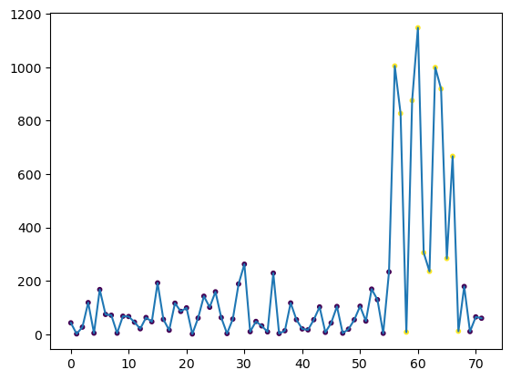
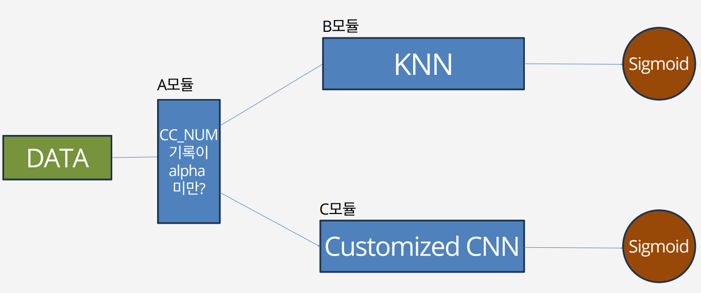
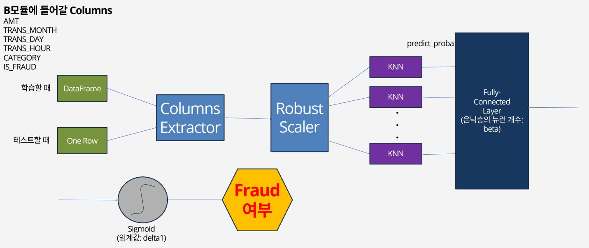
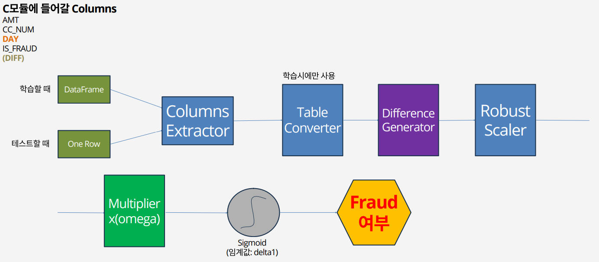
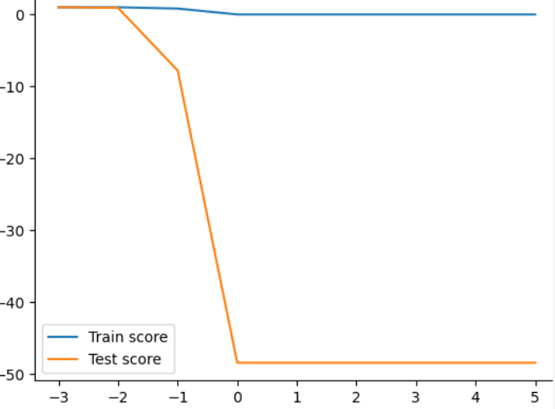
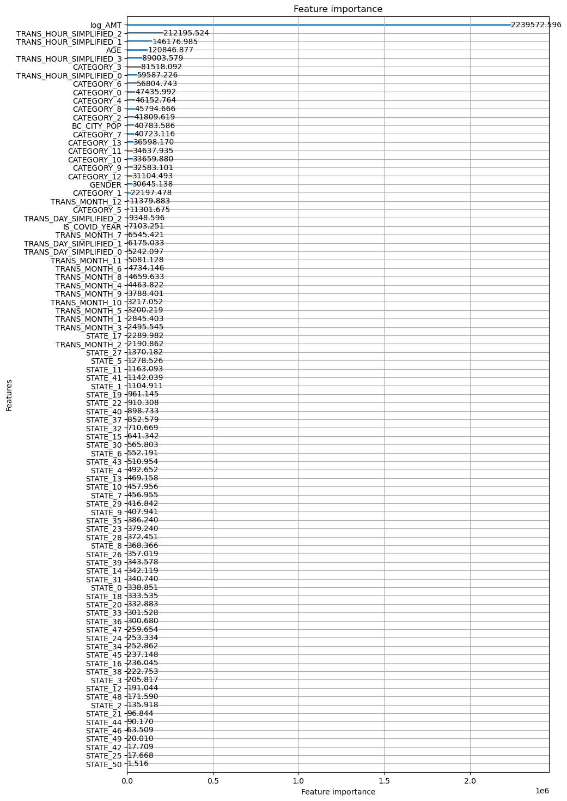

# FraudDetectionProject2023

## Team 팀원명
* 나도엽
* 신승운
  
## Project Summary 프로젝트 개요
* 이 프로젝트는 신용카드의 부정거래 데이터를 분석하고, 패턴을 파악하여 그 인사이트를 기반으로 모델을 설계, 구현하는 프로젝트입니다.
* 이 프로젝트로부터 나온 인공지능은 80%의 정확도로 신용카드 부정거래 여부를 탐지합니다.
* 이 프로젝트로부터 나온 머신러닝 모델은 부정 거래에 대해 91% 탐지력과 80%의 정확도를 지니고 있습니다.

## Project Index 프로젝트 진행 순서
1. kaggle에서 데이터 수집
2. Oracle SQL로 데이터 가공
3. 데이터 분석(미완성)
4. 인공지능 아키텍처 설계, 구현 및 성능 결과
5. 머신러닝 모형 설계, 구현 및 성능 결과

### Data Source 데이터 수집
다음의 웹 사이트에서 fraudTest.csv와 fraudTrain.csv를 다운로드
https://www.kaggle.com/datasets/kartik2112/fraud-detection?datasetId=817870&sortBy=voteCount

## EDA 데이터 가공

* Oracle SQL을 기반으로 하며, Oracle SQL Developer 툴을 사용함

사용된 컬럼들 정보
* TRANS_NUM
* CC_NUM
* TRANS_DATE_TRANS_TIME
* CATEGORY
* AMT
* GENDER
* CITY
* STATE
* CITY_POP
* JOB
* DOB
* IS_FRAUD

TARGET: IS_FRAUD  
  
날짜 형식이 데이터마다 제각각이기 때문에 날짜 형식을 통일하는 SQL 쿼리를 대입

## Data Analysis 데이터 분석 (미완성)
가공된 데이터로부터 패턴을 추출

  
하나의 CC_NUM에 대해서 시간 순으로 정렬했을 때, 거래량 차이가 크면 FRAUD일 가능성이 크다고 판단함

## AI Model and its Result 인공지능 아키텍처 설계, 구현 및 성능 결과

* 첫 번째 사진은 전체적인 모듈의 흐름을 보여준다.
	* A모듈은 학습이나 추론을 할 때, B모듈로 갈지, C모듈로 갈지를 결정하는 모듈이다. 매우 간단하기 때문에 따로 사진을 첨부하진 않는다.

* 두 번째 사진은 B모듈 아키텍처를 설명하는 사진이다.
	* Columns Extractor는 이 모듈에서 사용할 컬럼들만 남기고 나머지는 제거하는 모듈이다.
	* Robust Scaler는 RobustScaler 객체를 적용하는 모듈이다.
	* KNN 모듈의 반환값은 각각의 2가지 컬럼들을 바탕으로 한 FRAUD의 가능성 예측값이다.
	* 완전연결층까지 거친 값은 시그모이드 함수로 최종 확률이 정해진다.
	* 임계값 이상이라면 fraud, 아니라면 not fraud를 반환한다.

* 세 번째 사진은 C모듈 아키텍처를 설명하는 사진이다.
	* Table Converter는 하나의 feature당 하나의 컬럼으로 대응된 테이블을 여러 개의 AMT 컬럼들과 각 AMT별 FRAUD 여부를 나타내는 컬럼들로 변환하는 모듈이다. 이 때 하나의 CC_NUM이 하나의 데이터이다. 즉 CC_NUM별로 시간 순에 따른 AMT들과 각 AMT별 FRAUD여부를 보여주는 테이블로 변환한다는 뜻이다.
	* Difference Generator는 어떤 AMT값과 그 직전의 AMT값의 차이를 구하고 가중치를 곱해주는 모듈이다.
	* Multipllier는 단순히 하나의 컬럼에 실수배를 해 주는 모듈이다.
	* Sigmoid 부터는 B모듈과 동일

* 모델 구현은 py확장자를 사용하여 ipynb에서 import하는 식으로 구성하였다. (사용한 라이브러리)

	* numpy
	* scikit-learn
	* pandas
	* matplotlib
	* keras(Tensorflow)

모델 테스트 세트 검증 결과 __정확도 80%__ 성능을 보여주었다.  
  
    

## ML Model and its Result 머신러닝 모형 설계, 구현 및 성능 결과
사용한 11개 features: 
* IS_COVID_YEAR: year의 정보를 담은 것
* TRANS_MONTH
* TRANS_DAY_SIMPLIFIED
* TRANS_HOUR_SIMPLIFIED
* CATEGORY
* GENDER
* STATE
* AGE
* IS_FRAUD
* log_AMT: log스케일된 거래 금액
* BC_CITY_POP: box-cox로 변환된 도시인구  
__(!)__ CITY와 JOB은 컬럼 더미기법에 의해 지나치게 많은 컬럼을 형성하여 모델 생성이 어려우므로 제외하였다.  
  
  
### ML Model and its Reasoning 머신러닝 모델 선정 및 이유 
__1. Logistic regression(Lasso)__  
* 데이터 타겟값은 이상거래 탐지 여부로 분류 형태를 지니고 있다.
* 부정 거래 데이터가 약 9000개로 전체 160만개 데이터에 비해 매우 적은 숫자임을 고려하여 과적합을 규제하는 Lasso를 선택한다.
  
__☞ Result 결과__: train score = 0, test score = -50 로 모델 부적합 판정
  
__2. LightGBM(gbdt)__
* 성능이 우수하여 인기있는 머신러닝 모형이다.
* 이상치 영향을 받지 않는 트리 기반 모형이기에 선정하였다.
* 타겟 데이터 불균형은 SMOTE를 통해 조정하였다.
* 세부 파라미터는 수동으로 직접 조정하였다.
* 모형이 예측한 값에 대한 이진분류 기준은 precision_recall_curve를 이용하여 0.16을 설정하였다.  
__☞ Result 결과__: Accuracy: 0.99, Precision: 0.80, Recall: 0.91  
Despite 99 accuracy of classifications, the point is considering both precision and recall. Although both can be closed to f1-score to be balanced, the banks would usually like to detect fraud transcactions as much as possible in spite of sacrificing its precision. Hence, This model can __detect fraud with 91% probability and it precision is 80%.__  
Accuracy 점수는 99점으로 분류 능력 자체는 우수해보이지만 본질적인 것은 1을 만났을 때 제대로 감지하는 지 여부(precision)와 이를 감지하는 민감도(recall)값의 조정이다. 실질적으로 은행은 감지하는 민감도를 정확도보다 상대적으로 더 중요하게 여기므로, f1 점수에 맞게 둘을 0.85로 차이없이 맞추는 대신, 정확성을 조금 희생하고 민감도를 올린 모형이 적절하다고 판단할 수 있다. 이 모형은 __91%확률로 부정거래를 감지하고, 그 정확성은 80%이다.__
  

### Feature Importanct 모델 변수 중요도 시각화 
  
Feature importance shows AMT, hour(2), category(3), AGE, day(2), month(12), CITY_POP and STATE(17) have comparatively strong correlations.  
이 그래프 결과는 금액 양, 시간(2), 카테고리(3), 나이, 날(2), 12월, 인구 수, 17번 주 지역에서 상대적으로 상관관계가 높음을 보여준다. 
  
  
### Model Limitation 모델의 한계
* 모델의 민감도와 정확도가 더 개선된 형태가 있을 수 있으나 그것이 LightGBM내에서 개선하기 어려운 상태이다.
* log_AMT와 CITY_POP 대신에 robust scale을 적용해서 모델을 학습했다면 결과가 더 좋았을까? 에 대한 의문이 있다.
* 각 feature의 중요도가 보여주는 것은 인과관계가 아닌 상관관계이다. 그리고 이 상관관계는 부정 거래의 경향성만 보여주는 것이 아닌 160만개의 정상거래도 포함하므로 부정 거래의 트랜드를 파악하기 어렵다.  
  
  

-------------------------

## 따라하는 방법

1. Download fraudTest.csv and fraudTrain.csv from https://www.kaggle.com/datasets/kartik2112/fraud-detection?datasetId=817870&sortBy=voteCount

2. Run Data_Wrangling_part1.ipynb 

3. Open Oracle SQL Developer and execute Table_script.sql

format of table's columns is,
TRANS_NUM
CC_NUM
TRANS_DATE_TRANS_TIME
CATEGORY
AMT
GENDER
CITY
STATE
CITY_POP
JOB
DOB
IS_FRAUD

4. Import data to "FD" table from data/Fraud_Detection.csv
(Check the tablespace storage size)

If tablespace is lack, type the sql prompt command.
a. SELECT * FROM DBA_DATA_FILES;
-> Find the path of SYSTEM.DBF
b. ALTER DATABASE DATAFILE 'path' RESIZE 9G;

5. Run SQL_work.sql

6. Run SQL_datatype_modify.sql

7. Run SQL_create_features.sql

8. Run Data_Wrangling_part2.ipynb

9. Run save_splitted_table.ipynb

10. Run data_analysis.ipynb and data_analysis2.ipynb to see the graph.

11. Run Model/Model_main.ipynb for learning and testing the model.

12. Run Fraud_Detect_Model(ML).py for learning and testing the model.
